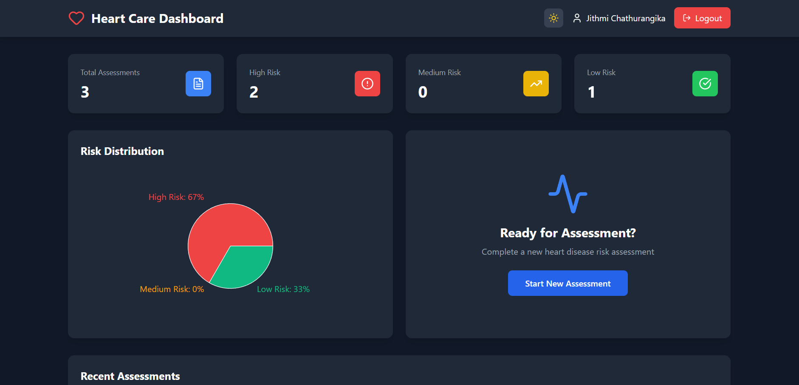

# 🫀 Heart Disease Risk Prediction System

A full-stack web application that predicts heart disease risk levels using machine learning and provides explainable insights to support early medical decision-making.



---

## 📌 Project Description

The **Heart Disease Risk Prediction System** is a web-based healthcare application designed to assess an individual’s likelihood of developing heart disease. By analyzing patient clinical data and lifestyle factors, the system predicts risk levels (Low, Medium, or High) and explains the key contributing features using Explainable AI (XAI) techniques.

This project aims to support early detection, preventive care, and data-driven decision-making in the healthcare domain.

---

## 🎯 Objectives
- Predict heart disease risk using machine learning
- Classify patients into Low, Medium, and High risk groups
- Provide explainable insights for predictions
- Securely manage patient data
- Visualize health metrics and prediction results

---

## 🚀 Features
- 🔐 JWT-based user authentication
- 🧠 Machine learning risk prediction
- 📊 Risk classification (Low / Medium / High)
- 🔍 Explainable AI (feature importance)
- 📈 Interactive charts and analytics
- 📄 PDF report generation
- 🌙 Light / Dark mode UI
- 📱 Responsive web interface

---

## 🛠️ Tech Stack

### Frontend
- React.js
- Tailwind CSS
- Axios
- Recharts
- Lucide Icons

### Backend
- Flask
- Flask-CORS
- Flask-PyMongo
- JWT Authentication

### Machine Learning
- Scikit-learn
- NumPy
- Pandas
- Joblib

### Database
- MongoDB (MongoDB Atlas)

---

## 📊 Input Parameters
- Age
- Gender
- Chest Pain Type
- Resting Blood Pressure
- Cholesterol Level
- Maximum Heart Rate
- Clinical and lifestyle indicators

---

## 📤 Output
- Heart disease risk level (Low / Medium / High)
- Prediction confidence
- Explainable feature contributions
- Data visualizations
- Downloadable PDF health report

---

## 🧠 Explainable AI (XAI)

Explainable AI techniques are used to:
- Identify important input features
- Improve transparency of predictions
- Increase patient and clinician trust
- Support medical interpretation

---

## 📂 Folder Structure
```bash
heart-disease-prediction/
│
├── backend/
│ ├── app.py
│ ├── config.py
│ ├── requirements.txt
│ ├── models/
│ │ ├── heart_disease_model.pkl
│ │ └── scaler.pkl
│ └── .env
│
├── frontend/
│ ├── package.json
│ ├── public/
│ └── src/
│ ├── App.jsx
│ ├── components/
│ ├── pages/
│ └── context/
│
└── README.md

```
---

## Screenshots

### Home Page

[Click me](#home-screenshot) to view in detail

### Dashboard

[Click me](#dashboard-screenshot) to view in detail

## Interactive Documentation

For a better viewing experience with detailed screenshots, please visit [Documentation Page](./docs/screenshots.html)

---

## ⚙️ Installation & Setup

- Clone the Repository
```bash
git clone https://github.com/your-username/heart-disease-prediction.git
cd heart-disease-prediction
```
### Backend Setup
```bash
cd backend
python -m venv venv
venv\Scripts\activate
pip install -r requirements.txt
```
- Create .env file
```bash
MONGODB_URI=your_mongodb_uri
JWT_SECRET=your_secret_key
FLASK_ENV=development
PORT=5000
```
- Run backend
```bash
pyhton app.py
```

### Frontend Setup

- Run Frontend
```bash
cd frontend
npm install
npm start
```


